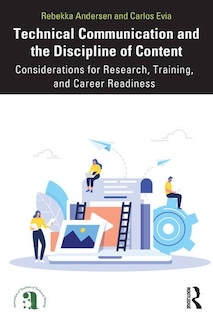

# Technical Communication and the Discipline of Content

Companion repository for the book ["Technical Communication and the Discipline of Content: Considerations for Research, Training, and Career Readiness"](https://www.routledge.com/Technical-Communication-and-the-Discipline-of-Content-Considerations-for-Research-Training-and-Career-Readiness/Andersen-Evia/p/book/9781032588469), by Rebekka Andersen and Carlos Evia.

This repository introduces ideas for situating the intersection of technical communication and the discipline of content in college curricula. Given the limitations that undergraduate courses and programs in technical communication and related fields face at different institutions, we are careful to avoid generalizations and absolute recommendations. For programs interested in building pathways for students to pursue careers in the discipline of content, we suggest a staged approach, with each stage increasing in complexity and engagement. For each stage, we describe topics to cover and why and offer both resources and suggested activities. 

For additional context, please refer to chapter 7 of the book.

## Stages

- [**Stage 1:** Situate *Our* Type of Content](stage1/overview.md)
- [**Stage 2:** Introduce Content Strategy](stage2/overview.md)
- [**Stage 3:** Focus on Content Creation and Management](stage3/overview.md)
- [**Stage 4:** Deliver and Maintain](stage4/overview.md).
